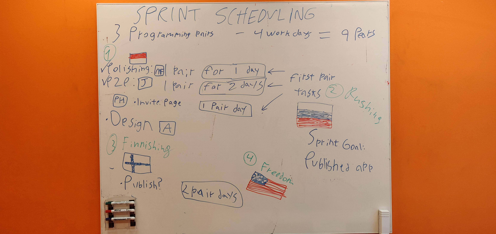

# Hunting app
## Project description
We're creating an app that hunters can use as an alternative to the communication radio. The main features will be:
- Creating groups to add everyone in the hunting team
- Push to talk communication
- Map for locating your peers

## **Progress**
### Sprint 1

|  Goal         | Description   | Result  |
| ------------- |:-------------:| -----:|
| Groups      | Handle groups, create and join | A few tasks are transferred to sprint 2 |
| Runnable app      | Create a base to build upon | Done |
| Accounts | Handle account information | Done |

### Sprint 2

|  Goal         | Description   | Result  |
| ------------- |:-------------:| -----:|
| Groups      | Join group, security | Done, security was simplified |
| Settings page      | Create the page and store user settings | Done |
| P2P voice chat | Figure out peer 2 peer communication | A lot of progress made, plan on finishing in the first two days of sprint 3 |

### Sprint 3

|  Goal         | Description   | Result  |
| ------------- |:-------------:| -----:|
| Polishing      | Small fixes to groups etc | - |
| Invite page      | Create a page for viewing and accepting/declining invitations | - |
| P2P voice chat | Figure out peer 2 peer communication | - |
| Publish | Get the app ready for publishing to play store, GDPR etc | - |

## Snapshot from the third sprint planning meeting

## About us
Team Transmission is a goup of 6 ICT students at KTH in Stockholm and we're doing this project is a part of the course *Il1305 Project in information and communication technology*. The idea came from a team member's brother who is a frequent hunter and felt like this app has been missing from the market. We're excited about taking on this challenge and learn more about team work and app development!

## Contact us
[Alexandra Kolonia](mailto:alex.kolonia@hotmail.com) 
[Frida Mattsson](mailto:frida_mattsson97@hotmail.com) 
[Paromita Banik](mailto:paromita@kth.se) 
[Hansika Attanayake](mailto:ghat@kth.se) 
[Justin Lex](mailto:jtlex@kth.se) 
[Mikhail Vlasov](mailto:vlasov@kth.se) 
